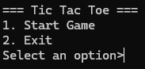
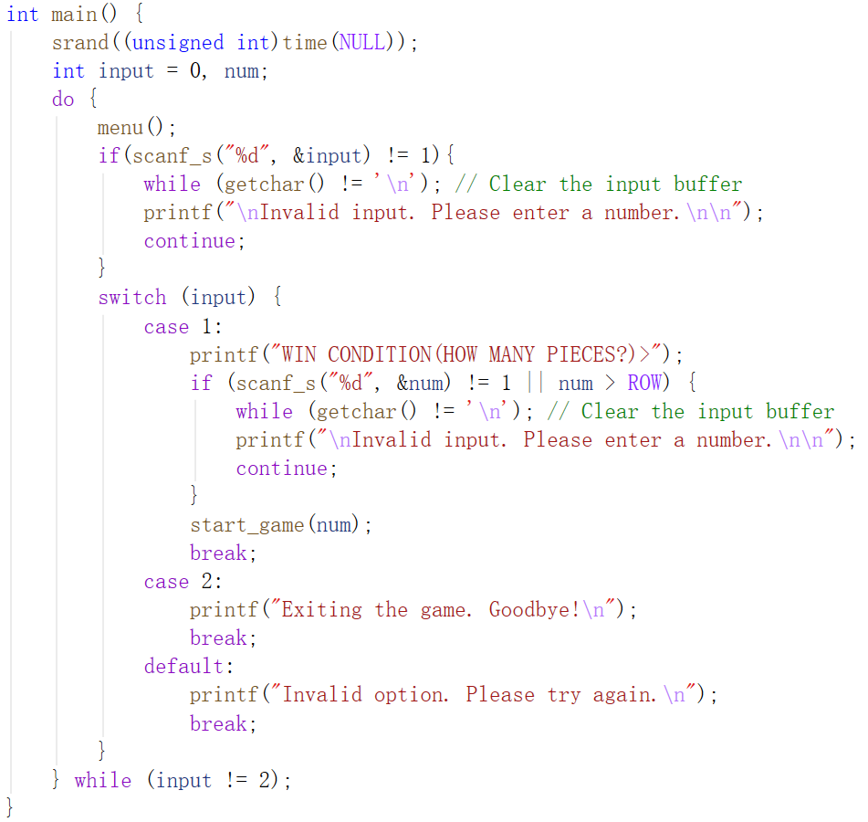

# 三子棋游戏

一个用 C 实现的三子棋游戏。

## 项目简介
- 开发环境：Visual Studio 2026
- 语言：C
- 项目类型：C语言游戏
- 主要功能：
  - 显示棋盘
  - 人机对战
  - 判定胜负
  - 自定义胜利棋子数
  - 自定义棋盘大小

这是我在大一学习C语言课程完成的实践项目，主要练习了：
- 函数传参
- JavaDoc风格的注释
- 通过循环寻找最长连续相同元素的字串
- 函数的输入内容的边界判定

## 运行截图

## 如何运行项目
1. 确保安装 Visual Studio（推荐 2022 或以上社区版，免费）
2. 下载本仓库（点绿色的 Code → Download ZIP，或用 git clone）
3. 双击打开 `XXX.sln` 文件（解决方案文件）
4. 在 Visual Studio 中按 F5 运行（或 Ctrl + F5 无调试运行）

## 项目结构

## 个人信息
- 作者：曾祥龙
- 学校：宁波工程学院 统计与数据科学学院
- 专业：信息与计算科学
- 年级：2025级
- 邮箱：zengxianglong@nbut.edu.cn
- GitHub： https://github.com/nowasiki

> 欢迎 Star ⭐ 和 Fork！如果代码有问题或建议，欢迎提 Issue～

感谢查看我的项目！
